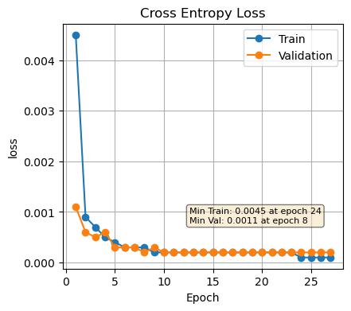
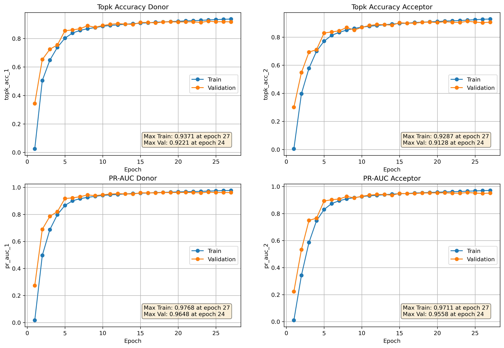

# SpliceAI

Implementation of [SpliceAI](https://www.cell.com/cell/pdf/S0092-8674(18)31629-5.pdf) models in Pytorch

### Setup 

Create conda/mamba environment

```
mamba env create -f environment.yml 
mamba activate spliceAI
```

### Download datasets for training and testing the models

Download from Google Cloud Storage
```
python3 utils/download_dataset.py
```

You can also recreate datasets from scratch with 

```
python3 utils/create_datasets.py \
        --fasta # reference genome - leave as "" to download
        --gff  # reference genome gff annotations - leave as "" to download
        --chrom # chromosome id map - leave as "" to download
        --flank 5000 # 5000 if you want to prepare datasets for the largest SpiceAI model
        --outdir <Path to output directory>
```

### Train model

```
python3 model/train.py 
--train_data data/datasets/train.pkl 
--val_data data/datasets/val.pkl 
--train_fraction 0.02 # set to 1. to train on entire dataset
--val_fraction 0.2 # set to 1. to validate on entire dataset
--batch_size 256 
--num_epochs 200 
--learning_rate 0.001 
--flank 5000 # 5000 is for SpliceAI_10k model
--seed 1809 
--output_dir <Path to output directory to save model checkpoints and log file>
```

### Result 

#### Loss curves


#### Metrics
